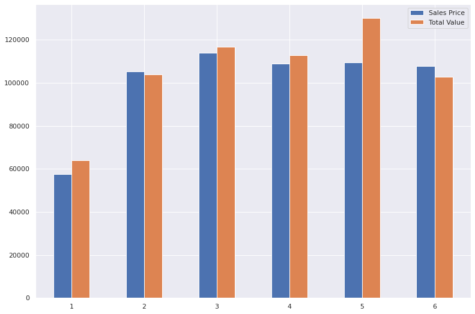
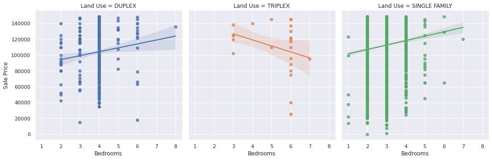

# Machine Learning Final Project--Lakin,Corrina
python

## Link to data set: https://www.kaggle.com/datasets/tmthyjames/nashville-housing-data

    I also uploaded the excel file I used for this data set. The column Suite/ Condo # 
    was not recognizable but it was one that I needed to get rid of, so I convereted to
    an excel spreadsheet and deleted that column. I used code to filter down all of the
    other columns I was not going to use.
    
## Why this dataset

    I chose this dataset for analysis from a rehabbing perspective. When looking at the 
    data, you can see Sales Price values compared to Total Value of house and property,
    bedrooms, bathrooms, finished area (square footage), etc. 
    
    
### Total Value Avg vs Sale Price Avg

  

    
    

  This information can give a trend of what prices houses are selling for vs what their
  acutal worth is. When looking for houses to rehab, you can start with this to help
  guide you towards data of houses currently on the market to look at for a potential 
  flip.
  
### Total Value vs Sale Price by Exterior Wall

  Depending on the makeup of the exterior walls, you can eleminate certain types based
  on what it could take to fix/replace them. You can also see trends for that area as
  to what exterior walls are more common for the area or what is trending in the area. 
  For example, Stucco is very popular in the South West, but is not as common in the 
  mid-west.
  

    
    

### Sale Price vs Bedrooms

    I don't think this dataset give accurate information for Triplex's with the information 
    that was gathered. The single family homes have the highest increase in sales price as
    the number of bedrooms increase. This is a typical trend. 
    

        
    

    
