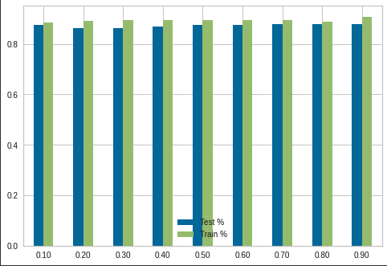
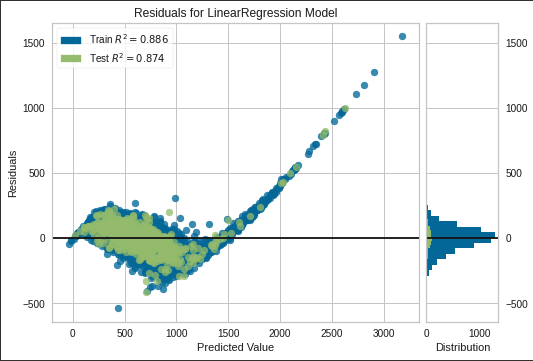

# Machine Learning Final Project--Lakin,Corrina
python

## Link to data set: https://www.kaggle.com/datasets/tmthyjames/nashville-housing-data

    I also uploaded the excel file I used for this data set. The column Suite/ Condo # 
    was not recognizable but it was one that I needed to get rid of, so I convereted to
    an excel spreadsheet and deleted that column. I used code to filter down all of the
    other columns I was not going to use.
    
## Why this dataset

    I chose this dataset for analysis from a rehabbing perspective. When looking at the 
    data, you can see Sales Price values compared to Total Value of house and property,
    bedrooms, bathrooms, finished area (square footage), etc. 
    
    In this dataset I map for the Land Use since there were only 3 that I kept, and 
    I used one label encoding on the Property City. I created additional columns for avg 
    sale price and total value by bedrooms to gather some initial data. I might have been 
    using the one hot encoding improperly, but it did not seem to give me the results I 
    was expecting. 
    
    
### Total Value Avg vs Sale Price Avg

    This information can give a trend of what prices houses are selling for vs what their
    acutal worth is. When looking for houses to rehab, you can start with this to help
    guide you towards data of houses currently on the market to look at for a potential 
    flip.
    
    From this information, when selecting the number of bedrooms of houses to go look at
    for possible flips I would narrow my search to the 3-5 bedroom homes. The housing market
    that we are currently in, houses are selling for well over their actual value, but this 
    is not something you can depend on lasting. When you can purchase a house for a decent 
    amount under it's value, you have room to put money towards renovations and see a profit
    in the return when the house sells. A lesson learned from previous flips is that sometimes
    the land is worth more than the house itself, so restoring/renovating on these properties 
    can be very lucrative. 

    
    

  
  
### Total Value vs Sale Price vs Bedrooms by Land Use

    In this dataset Land Use tells you what type of home it is, Single Family, Duplex, Triplex, etc..
    I have widdled down the dataset to only include those 3. 

    
    

### Total Value vs Sale Price vs Bedrooms by Exterior Wall

    I used a ploty diagram for this. It shows where the data is more condensed. The thing that I like
    about this diagram/graph is that you can move it around depending on the direction you would like
    to view it, but you can also just hover over specific dots to get the information from them. I also
    really like that you are able to zoom in and out on these diagrams/graphs.

    

### Training and Test set accuaracy
    
    The bar graph below shows the difference in accuracy between the test and train set in the range of 
    the test set being comprised of 10-90% of the data. The train set always has slightly higher accuracy
    but both are pretty close.

    

    
    
### Residuals of the Linear Regression Model

    The graph plots as I would have expected with a large portion of the data grouped in one area. This
    is pretty comparable to the other graphs displayed above, showing that the range of sales vs values
    are largely in a tight focused area. The distribution shows a very nice bell curve. I am not sure 
    what I was expecting here, but it plots nicely. 

    

  

### Decision Tree

    I could not get the decision tree to print out like in all the examples that I saw. Then I came across
    how to export the text of it the screen and that worked, but it only shows a very small amount.
   

    

  
    
    
