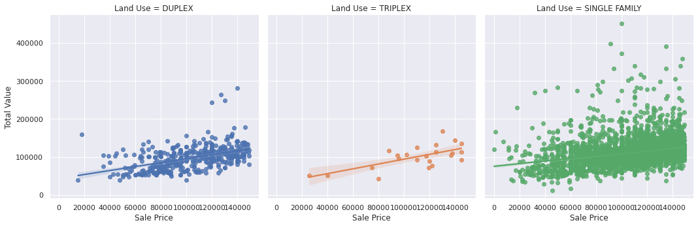

# Machine Learning Final Project--Lakin,Corrina
python

## Link to data set: https://www.kaggle.com/datasets/tmthyjames/nashville-housing-data

    I also uploaded the excel file I used for this data set. The column Suite/ Condo # 
    was not recognizable but it was one that I needed to get rid of, so I convereted to
    an excel spreadsheet and deleted that column. I used code to filter down all of the
    other columns I was not going to use.
    
## Why this dataset

    I chose this dataset for analysis from a rehabbing perspective. When looking at the 
    data, you can see Sales Price values compared to Total Value of house and property,
    bedrooms, bathrooms, finished area (square footage), etc. 
    
    
### Total Value Avg vs Sale Price Avg

    This information can give a trend of what prices houses are selling for vs what their
    acutal worth is. When looking for houses to rehab, you can start with this to help
    guide you towards data of houses currently on the market to look at for a potential 
    flip.

    
    

  
  
### Total Value vs Sale Price by Land Use

    In this dataset Land Use tells you what type of home it is, Single Family, Duplex, Triplex, etc..
    I have widdled down the dataset to only include those 3. 

    
    

### Sale Price vs Bedrooms

    I don't think this dataset give accurate information for Triplex's with the information 
    that was gathered. The single family homes have the highest increase in sales price as
    the number of bedrooms increase. This is a typical trend. 

    

    
